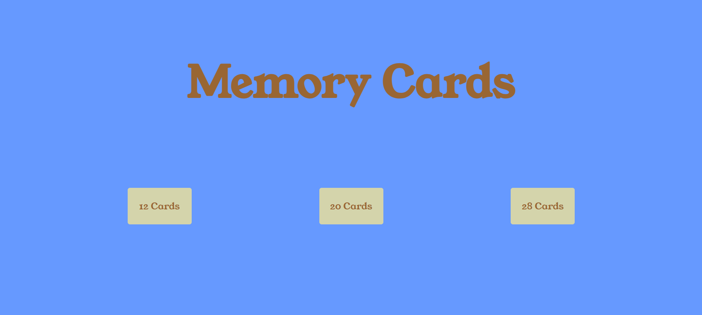
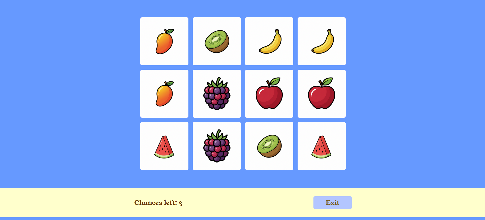
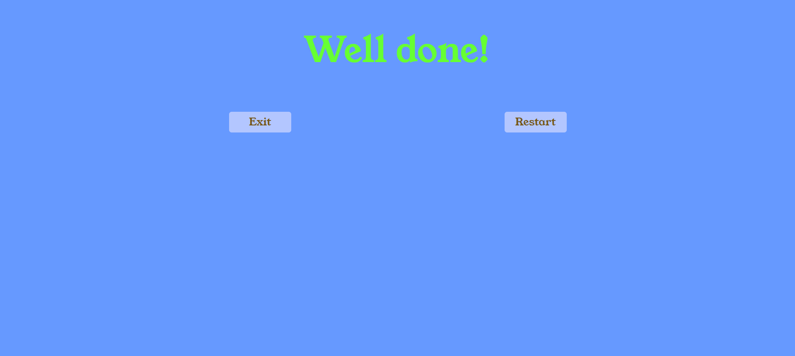
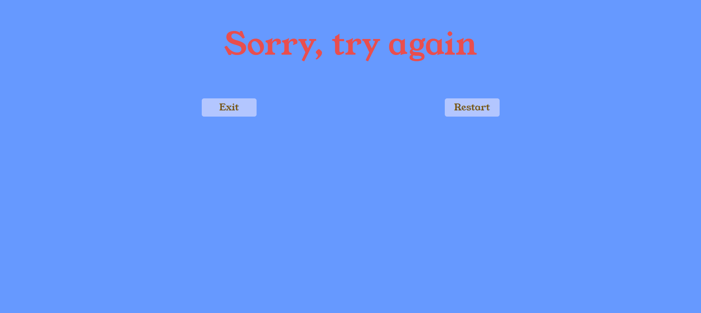
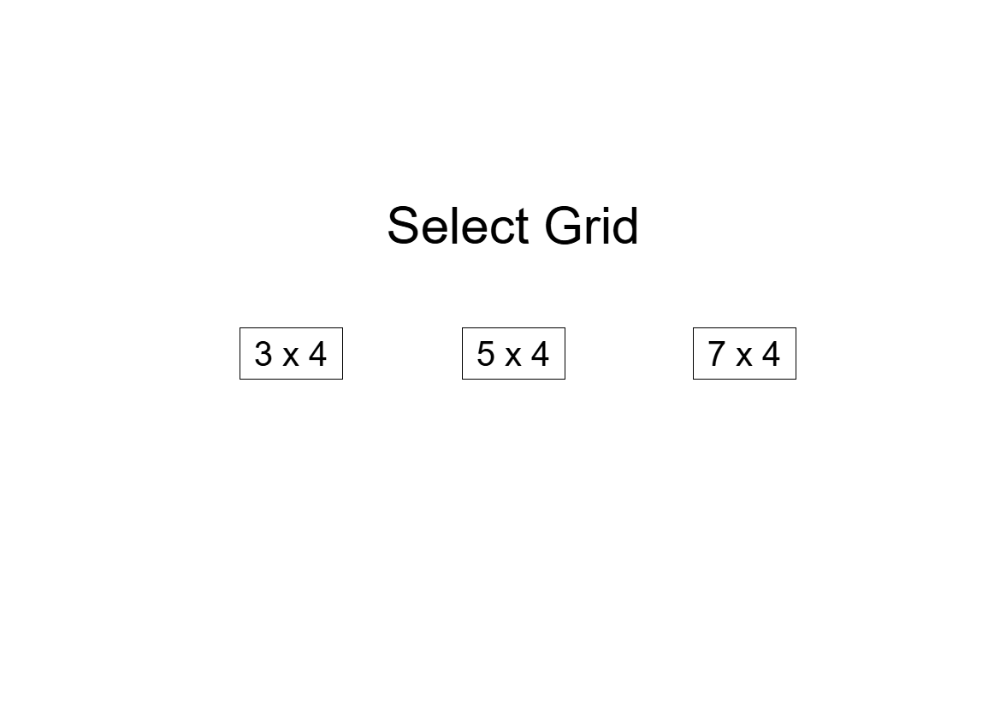
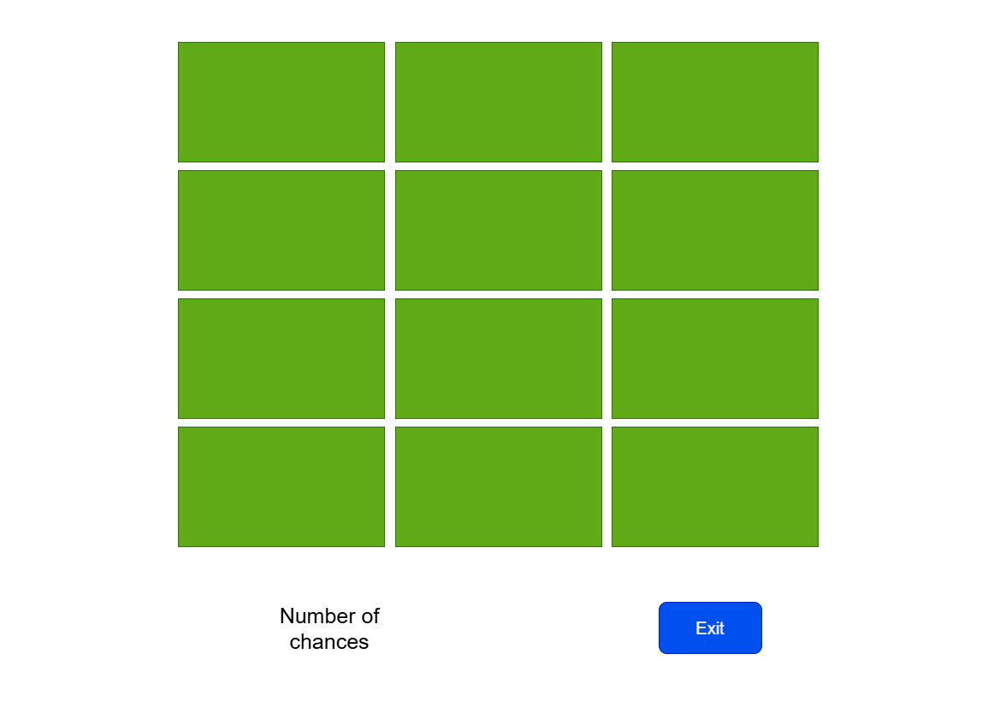
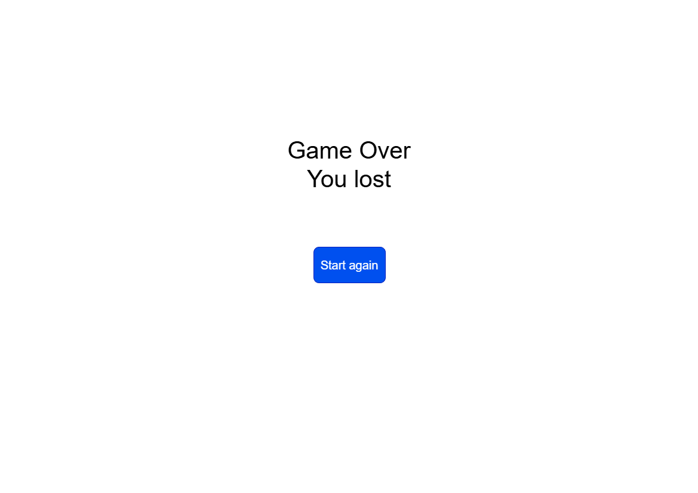

# MD Template #

## Date 2/5/2026 ##

### By: Hasan Mahfoodh ###

#### [LinkedIn](www.linkedin.com/in/hasan-mahfoodh-84916b3a8) | [GitHub](https://github.com/v7sn0) ####

***
### Description ###
A memory card game, where the user flips cards, trying to find two matching cards each time.

***

### Technologies ###

* HTML
* CSS
* JS

***

### Getting Started ###
  Choose how many cards you want to play with, then start playing the game.
***

### Screenshots ###
#### Starting Screen ####

#### Gameplay Image ####

#### celebration Screen ####

#### Game Over Screen ####

#### Starting Page Structure ####

#### Game Page Structure ####

#### Winner Page Structure ####

#### GameOver Page Structure ####

***

### Task List ###
- [x] Creating the structure of the game
- [x] Making the game functional
- [x] Styling the game

### Credits ###
##### Animate.css Library: [Animate.css](https://animate.style/)
##### Gemini AI (to make the fruit pictures): [Gemini](https://gemini.google.com/app)
